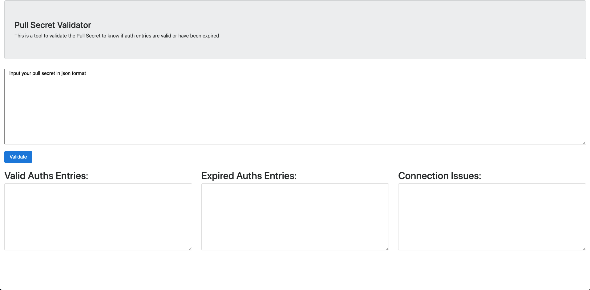

# Pull Secret Validator

This is a tool to validate the Pull Secret to know if auth entries are valid or have been expired

## How to work:

Just paste your Pull Secret in a json format and validate it.
The response will be in three column to get the valid, expired entries as well as the entries with connectivity problem (local registry, and so on)

